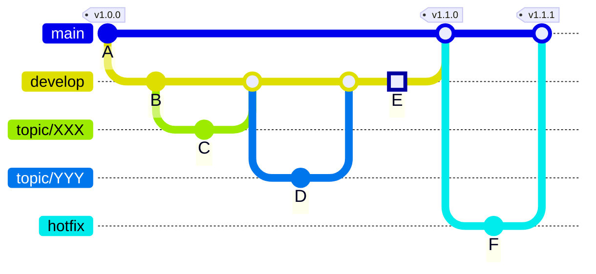

# Contribution Guide

Welcome your contributions, included bug report and feature development.

## Overview

There are two ways to contribute, "Bug report" and "Fix(Develop) feature".

### Bug Report

This is the easiest way to report a problems.

If you find a problem or issue, let's create issue ticket!
You can create an issue ticket at [Issues](https://github.com/LeavaTail/exfat-rawtools/issues).

In summary, the contribution steps are as follows.

1. check opened issue ticket
2. create issue ticket

⚠️ Note that make sure it has not already reported before create issue ticket

### Fix Feature

If you can fix or develop the feature, let's develop it together!
Please create [Issues](https://github.com/LeavaTail/exfat-rawtools/issues)
in the same way as [Bug Report](#bug-report).

When you have completed your work in the forked repository, please create
[pull request](https://github.com/LeavaTail/exfat-rawtools/pulls)

In summary, the contribution steps are as follows.

1. check opened issue ticket
2. create issue ticket
3. fork this repository to yours
4. Commit your local repository and add Signed-Off information
5. Please send pull request to develop

## Issue Rules

- [ ] The issue is not focused in the community (An issue ticket has not been create)
  - If you find a similar ticket, join the discussion on that ticket!
- [ ] Use of prepared Issue template
- [ ] Fill in the issue templete (as much as possible)
- [ ] "Assignees" is set who handles it
  - If you are not sure, assign [LeavaTail](https://github.com/LeavaTail)

## Pull Request

- [ ] Select target branch to "develop" branch.
- [ ] Use of prepared Pull request template
- [ ] Fill in the pull request templete (as much as possible)
- [ ] Check status is "passed"
- [ ] Please set reviwers to maintainer
  - If you are not sure, assign [LeavaTail](https://github.com/LeavaTail)
- [ ] Please set assinees to assign reviewers

## Commit Message

```
[${commit_type}] ${feature}: ${outline}

Issue: #${Issue_number}

${Detail}
```

- 1st line - commit outline
  - Select the appropriate `commit_type` from the following
    - Add: add new feature
    - Fix: fix current bug
    - Improve: update other
  - describe `feature` name (e.g. check, stat,...)
- 2nd line - Blank
- 3rd line - Issue number
- 4th line - Blank
- 5th line - Detail

🚧 **Preparing workflow to validate commit message** 🚧

## Branch rules

Inherit the concept of git-glow



- main (🔒): release branch.
  - main branch doesn't let us commit directly
  - main branch will be merged from devleop branch and hotfix branch.
    - A merge of develop branch will results in a minor version up
    - A merge of hotfix branch will results in a patch version up.
- develop: developing branch. Will merge into master.
  - develop branch doesn't let us commit directly without maintainer
    - Updates of changelog and preparation of release are handled by this branch.
  - develop branch will be merged from any topic/XXX(XXX is any sytring) branch.
- hotfix: To be fixed when bugs are discovered.
  - Fix critiacal bug in thi branch when users reported
- topic/XXX: (XXX is any string)
  - It's created when you do some wodk

## Coding Style

Follow the [Linux kernel coding style](https://www.kernel.org/doc/html/latest/process/coding-style.html)

## Review Point

Reviewers will keep the following points in mind when reviewing.

- [ ] Commit is created at the apprpriate granularity
  - Smaller commits are preferred over larger commits
  - Multiple fixes should not be included in a single commit
- [ ] You can explain a fix
  - Shouldn't be a fix that other developer don't understand
- [ ] A fix can be understood in a short time
  - The comment in source code and commit message are hints
- [ ] Not Degraded
  - Make sure that there is no change in test output results
